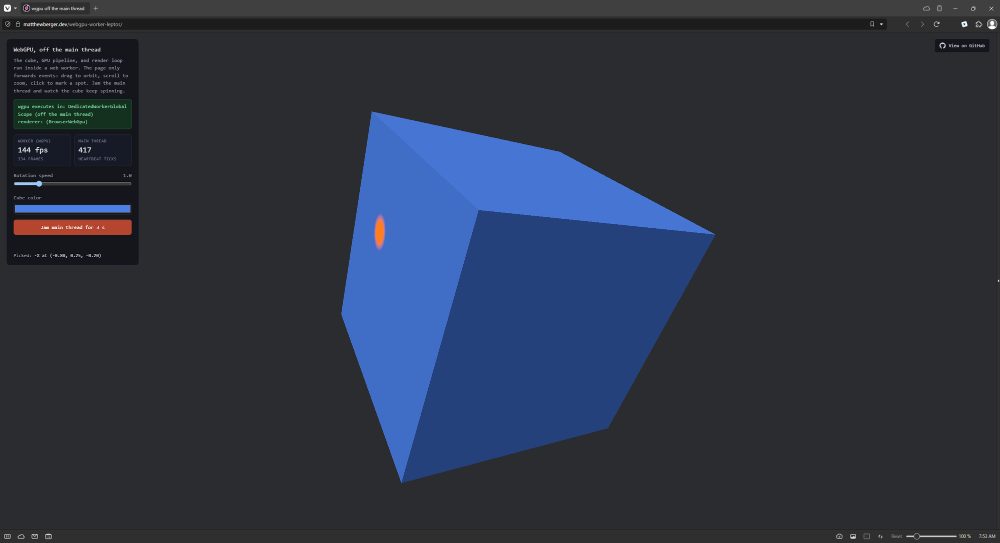

# webgpu-worker-leptos

A from-scratch [wgpu](https://wgpu.rs) app that runs in a web worker via WebAssembly, with a [Leptos](https://leptos.dev) frontend. No graphics code on the main thread: the worker owns an `OffscreenCanvas`, drives the render loop with `requestAnimationFrame`, and renders through WebGPU. The Leptos app on the main thread only transfers the canvas and forwards events.



[webgpu-worker](https://github.com/matthewjberger/webgpu-worker) built this with a TypeScript frontend and Comlink. This version is Rust on both sides: the page and the worker exchange messages defined once in a shared `protocol` crate, serialized over `postMessage`.

## Workspace

- `protocol` holds the message and data types both sides share, so the page and worker can never disagree on the wire format.
- `renderer` is the plain wgpu renderer: instance, surface, adapter, device, a depth texture, one uniform buffer, and a pipeline from inline WGSL that does Lambert shading. It is a normal Rust library with no JavaScript bindings.
- `worker` is the wasm module that runs inside the web worker. It owns the `WgpuApp`, sets `onmessage` on the worker scope, drives the render loop, and posts state back.
- The root crate is the Leptos app. It renders the control panel, transfers the canvas with `transferControlToOffscreen`, spawns the worker as an ES module, and forwards pointer, wheel, and control events.

## How it works

The page captures pointer drag (orbit) and wheel (zoom) on the canvas, coalesces them to at most one message per frame, and forwards them alongside the resize and rotation-speed and color controls. The worker streams frame counters back to drive the fps and frame readout, and answers an on-demand stats request so the "jam" button can measure exactly how many frames wgpu advanced while the main thread was blocked.

The surface comes straight from the transferred canvas via `wgpu::SurfaceTarget::OffscreenCanvas`, so nothing routes through `winit` or `raw-window-handle`.

## Differences from webgpu-worker and bevy-worker

All three put the GPU work off the main thread the same way: a worker owns an `OffscreenCanvas` and renders through wgpu while the page only transfers the canvas and forwards events. This one differs in two ways.

- **No Comlink, no TypeScript.** [webgpu-worker](https://github.com/matthewjberger/webgpu-worker) and [bevy-worker](https://github.com/matthewjberger/bevy-worker) drive the worker from a TypeScript page over [Comlink](https://github.com/GoogleChromeLabs/comlink). Here the page is a Leptos wasm app and the worker is a Rust wasm module, and they exchange plain `postMessage` values whose types are defined once in the shared `protocol` crate. There is no JavaScript glue layer and no way for the two sides to disagree on the wire format. Comlink's transparent proxy calls are replaced by an explicit request/response for the one round-trip that needs it (the stats poll behind the jam button) and one-way streams for everything else (frame counters, pick results).
- **Raw wgpu, not an engine.** Like webgpu-worker, the renderer talks to wgpu directly, so there is no `winit`, no `raw-window-handle`, and none of the `unsafe impl Send + Sync` window-handle wrapper that bevy-worker needs to satisfy Bevy's winit-shaped `Window` layer. bevy-worker runs the full Bevy engine inside the worker; this runs a hand-written wgpu renderer.

## Quickstart

Tooling is pinned in [`mise.toml`](mise.toml). Install [mise](https://mise.jdx.dev) and [just](https://github.com/casey/just), then:

```bash
mise install     # fetch the pinned toolchain
just run         # build the worker, the stylesheet, and serve at http://127.0.0.1:8080
```

Needs a browser with WebGPU and `OffscreenCanvas`-in-workers support (Chromium 113+, Firefox 141+).

## License

Dual-licensed under MIT or Apache-2.0, at your option.
